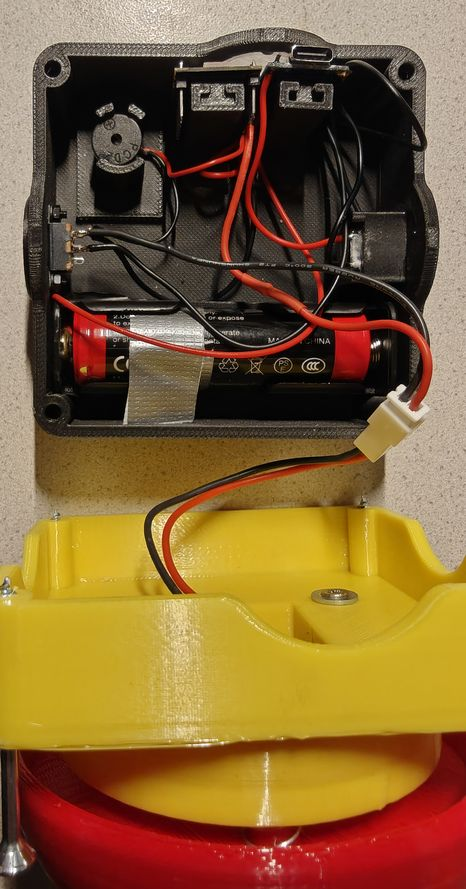

# Buzzer

Der **Buzzer** dient dazu, Bilder auf einer Fotobox auszulösen.  
Getestet mit **Photobooth 4.99** und **dslrBooth**.

---

## Funktionen

- **HTTP-Befehl** an einen Webserver senden  
- **MQTT-String** an einen Broker senden (optional)  

---

## Installation & Inbetriebnahme

1. **Buzzer einschalten** → startet einen **Access Point** (`Buzzer`).
2. Mit dem Handy verbinden und die **Weboberfläche** öffnen.
3. WLAN auswählen, mit dem sich der Buzzer verbinden soll
4. statische IP und Gateway eingeben.
5. HTTP-Befehl für den Webserver eingeben.
6. Optional: MQTT aktivieren und Broker-Adresse angeben.
7. Konfiguration speichern → Buzzer startet neu und verbindet sich automatisch mit dem WLAN.

---

## Statusanzeigen (LED)

| Status | Bedeutung |
|--------|-----------|
| Blaue LED dauerhaft an | Buzzer erfolgreich im WLAN angemeldet |
| Blaue LED blinkt | WLAN-Verbindung fehlgeschlagen → Access Point aktiv |
| Blaue LED leuchtet, nicht blinkt | Buzzer im WLAN, aber z. B. mqtt fehler |
| 1x Piep | http Befehl erfolgreich gesendet |
| 2x Piep | http Befehl erfolglos |

---

## Zugriff auf den Access Point

Wenn Änderungen nötig sind:

1. Buzzer ausschalten  
2. Buzzerknopf gedrückt halten  
3. Buzzer einschalten
4. blaue LED blinkt  
5. Mit dem Handy wieder verbinden → Weboberfläche aufrufen → Konfiguration ändern

---

## Verwendung / Auslösen

Drücke den **roten Knopf**, dann passiert Folgendes:

| Situation | Signal |
|-----------|--------|
| HTTP-Befehl erfolgreich gesendet | 1x Piepton |
| Webserver nicht erreichbar | 2x Piepton |
| MQTT aktiviert & Broker erreichbar | Blaue LED blinkt 1x |
| MQTT aktiviert & Broker nicht erreichbar | Blaue LED leuchtet dauerhaft |

